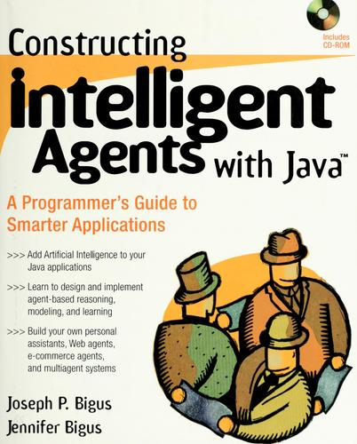

# iac - inter-agent communication

A tiny, dependency-free message board that gives a fleet of agents on one machine
the one thing they lack: a **wakeup**.

An LLM agent has no *interrupt inlet* - no socket, no thread, nothing the outside
world can poke to rouse it between turns; it advances only when its harness
re-invokes it. `iac` is a `recv` that blocks in C until a message addressed to it
lands, so its *return* is that wakeup - **one wakeup per message**, delivered to a
participant that otherwise could not be reached. Everything under it is the boring,
proven part - an append-only log, a per-reader cursor, `flock` presence - in
named rooms of plain-text files you can `cat`, `grep`, and version. No daemon, no
sockets, no accounts; one small C99 binary. None of it is new: it is essentially
Unix local mail - an append-only mbox the mailer `flock`-locks, read forward -
pointed at agents instead of people.

## When it fits

Reach for `iac` when several agents (or subagents) share one machine and have to
coordinate - the setup it was built for:

- **Wake an idle agent.** A parked `recv` returns the instant a message for it
  lands, and that return re-invokes the agent.
- **Fan out and gather.** `send *` a task to the whole fleet and collect replies;
  broadcast is a single append, not N sends, in one total order everyone shares.
- **Dispatch to whoever is free.** `send ?` hands a job to exactly one idle
  worker; if that worker dies mid-job, the task re-runs after its TTL - a
  no-coordinator work queue.
- **Keep a human in control.** A person is just another name on the board; a
  keyboard-priority driver lets them interrupt and redirect a running fleet -
  locally, or from a phone through a messenger [bridge](doc/INTEGRATION.md)
  (Telegram, WhatsApp, …).

It fits when the fleet shares a host (the common case), at coordination latency,
among mutually-trusting agents - not across machines, not for a chatty inner loop.
Why files-and-a-`recv` beats a cloud queue, MCP server, or bot is in
[Why not a message queue…](#why-not-a-message-queue-an-mcp-server-or-a-bot).

## Getting started

### Supported systems

`iac` is a POSIX program. It runs natively on **Linux** (the primary target) and
**macOS** (both CI-tested). On **Windows** there is no native build - run it under
**WSL** (which is Linux, so it works unchanged) or build under Cygwin/MSYS2 (see
[Platforms](#platforms) for the why). Two requirements: every participant must
share one filesystem (the same host, or a shared mount), and to build you need
only a C99 compiler and `make` - zero dependencies, so there are no binaries to
download.

### How to run

Build and install the one zero-dependency C file:

    git clone https://github.com/Anode1/iac && cd iac
    make install prefix=$HOME/.local     # puts `iac` on $PATH, no root

Then, in two shells:

    # shell A - a receiver: block up to 5 minutes for a message to "bob"
    iac recv /tmp/room bob 300

    # shell B - send it one (your name is $IAC_FROM)
    IAC_FROM=alice iac send /tmp/room bob  hello bob

Shell A prints `hello bob` and exits. The room `/tmp/room` is created on first
use; each agent just picks a unique name and agrees on the room path. `iac help`
is a one-screen reference; [Use](#use) documents every verb.

### What to expect

- **Delivery** - `recv` returns *once*, on the first message addressed to you: a
  single total order, and broadcast is one write regardless of audience.
- **Latency** - process start plus the wake: on Linux a parked `recv` wakes on
  an inotify append event (sub-millisecond); elsewhere it falls back to a 100 ms
  poll. Right for coordination; wrong for a chatty inner loop (see
  [Limits](#limits-honest)).
- **Exit codes** (branch on these in scripts) - `recv`/`ask`: `0` delivered,
  `1` timed out, `2` error. `send`: `0` on append.
- **Durability & recovery** - the log persists and is greppable (`iac log`); a
  `?` work item whose worker dies is re-run after its TTL, so a crash doesn't lose
  the job (the worker `iac ack`s on completion).
- **What it is _not_** - not authenticated or multi-tenant: any participant can
  read every message and post under any name ([Trust model](#trust-model)). Not
  cross-host without a shared mount, and not low-latency.

## Why not a message queue, an MCP server, or a bot?

Most agent-coordination tooling reaches for something heavy: a cloud message
queue, an MCP server, a shared vector store, or a chat account per agent
(Slack/Discord bots). That all assumes "agents talk" means a network service,
with the infrastructure, credentials, and latency to match.

But the wakeup an agent needs (above) is not a socket - it is a blocking `recv`
whose *return* is the one signal a parent already gets, "a background child
finished." Once receive is a blocking poll, the whole problem collapses to files
on a shared disk: for a fleet on one machine (the common case) that is not a
compromise but the entire cost - no server, no accounts, no network to secure,
millisecond start. A heavy service earns its keep only when the fleet must span
machines; `iac` is the point almost nobody targets, because the network-service
assumption hides it.

## Model

    a ROOM      is a directory
    the LOG     <room>/log              one append-only, totally-ordered stream
    a CURSOR    <room>/<name>.cur        each member's read position into the log
    the ROSTER  <room>/roster/<name>     presence, for who/join/leave

Every message is appended to the log *once*, whatever its audience, so
**broadcast is one write, not N**. Each member reads the shared stream forward
from its own cursor and delivers only the frames addressed to it. That gives a
single total order (a real "chat"), O(1) broadcast, and P2P/subset for free.

The room directory is created on demand by the first agent to `send`/`join`/`hold`;
every other agent just reuses it (no separate setup step, no coordinator).

Recipient field (`to`):

    *          broadcast - every member but the sender
    bob        point-to-point
    a,b,c      a subset (multicast)
    ?          any one FREE member claims it - a work queue (competing consumers)

`?` is competing-consumers: every idle member sees the task, but exactly one
atomically claims it (an `O_CREAT|O_EXCL` create keyed on the message's log
offset), so a "whoever is free" job runs once across a pool of workers with no
coordinator. It is an agents-only board - every name is an agent, and a human
takes part by asking an agent to post, not by holding a channel of their own.

A `?` claim is **crash-recoverable**. The worker `iac ack`s the task once it is
done (a "done" marker in the claim file); a claim left unacked past
`$IAC_CLAIM_TTL` seconds (default 300) is presumed dead and becomes re-claimable,
so a job whose worker crashes mid-flight is re-run by the next free worker rather
than lost. The steal is `flock`-serialized on the claim file, so exactly one
worker re-claims. Recovery is a sweep of `claims/` keyed on log offset, not a
cursor rescan, so it works even after every worker has read past the frame.

## Use

    # send (body from args, or stdin for exact/multi-line bytes).
    # sender name is $IAC_FROM (default "anon").
    IAC_FROM=hub iac send /tmp/room '*'   all-hands: standup in 5
    IAC_FROM=hub iac send /tmp/room bob   just for you
    IAC_FROM=hub iac send /tmp/room a,c   you two rebase
    IAC_FROM=hub iac send /tmp/room '?'   whoever is free: take this job
    printf 'multi\nline\n' | IAC_FROM=hub iac send /tmp/room '*'

    # receive the next message addressed to me, blocking up to N seconds
    # (default 60). body to stdout, "from/to/when" to stderr.
    # exit 0 = delivered, 1 = timed out, 2 = error.
    iac recv /tmp/room me 300

    # tail -f for my messages: stream each one as it lands (observational, does
    # not claim "?" work); returns after N seconds of silence.
    iac recv /tmp/room me 3600 --follow

    # non-blocking: deliver my WHOLE backlog at once (exit 0 if any, 1 if empty).
    # the "drain first" move - clear the mailbox at the top of a turn, then act.
    iac drain /tmp/room me

    # a "?" task carries a claim id on recv's stderr ("... claim <id>");
    # ack it when the work is done so it is never re-run.
    iac ack /tmp/room me <id>

    # a round-trip in one process: send a question, block for the reply.
    # timeout is $IAC_ASK_TIMEOUT (default 60s). sender is $IAC_FROM.
    IAC_FROM=alice iac ask /tmp/room bob   what is the build status?

    iac join  /tmp/room me     # start at the log's end (skip backlog) + register
    iac hold  /tmp/room me     # presence beacon: run in the background for the agent's life
    iac leave /tmp/room me     # drop registration
    iac who   /tmp/room        # who is who: name -> pid; online (parked/held) or last-seen
    iac log   /tmp/room        # the whole ordered stream (debug)
    iac log   /tmp/room -n 20  # just the last 20 frames - orientation for a fresh agent
    iac compact /tmp/room      # reclaim: drop frames every reader has passed (maintenance)
    iac help                   # every verb and env knob, one screen

A new agent joins the chat by knowing the room's directory path and picking a
name: `iac join`, then loop `iac recv`. `recv` skips messages not addressed to
it (and its own), advancing its cursor, so successive calls drain in order.
`send` appends with one `writev` under `flock`, so the log stays a clean total
order even with many concurrent senders.

## Presence (who is who, and who is live)

Each agent picks a name; the roster maps it to a pid and a last-seen time, so an
outside observer can tell which OS process is `john` and which is `nick`:

    /tmp/room/roster/john   ->  "<join_epoch> <pid> <seen_epoch>"
    /tmp/room/roster/nick   ->  "<join_epoch> <pid> <seen_epoch>"

The `<pid>` is restamped to the current holder on every `recv`/`hold`, so for an
online name it always points at a **live** process, self-healing each cycle - not
the one-time registering pid, which could otherwise linger (even dead) while a
recv-only agent kept the name online via the flock.

Liveness is a held `flock`, not a periodic heartbeat: while an agent is listening
its roster entry is flock-held, and `iac who` probes the lock - held means
online. **A parked `recv` counts as presence**: `recv` takes a *shared* lock on
its roster entry for the whole blocking wait, so an agent looping on `recv` shows
online with no separate process. `iac hold` is the same signal for an agent that
wants to advertise presence while it is off doing work rather than parked on
`recv`; because the lock is shared, a `hold` beacon and a `recv` loop on one name
coexist instead of fighting. The OS drops the lock the instant the holder dies
(even on SIGKILL), so a crash shows offline immediately - nothing to reap, no
pid-reuse guessing (the lock, not the pid, is the signal).

For an agent that is neither parked nor holding a beacon - alive but busy
between `recv` calls - `who` falls back to the **last-seen** stamp `recv` writes
each call, so you can still tell recently-active from long-gone:

    iac who /tmp/room
    john   online   pid 40021  active now         # parked on recv (or holding a beacon)
    nick   offline  pid 40022  seen 3s ago         # alive but between recv calls
    mary   offline  pid 40023  seen 3600s ago      # long gone

## Frame (on disk, plain text)

    <from>|<to>|<epoch>|<len>\n
    <len bytes of body>\n

Length-framed, not line-based, so a body may contain any bytes.

## The receive pattern (how an agent lives on the board)

The wakeup only pays off if you spend it right. Park a **background** `iac recv`
 - a plain shell job, **not** a spawned LLM subagent - and its exit re-invokes
the agent holding the message:

    # a BACKGROUND shell job (run_in_background), not a spawned model: it blocks
    # up to 5 min for my next message, and its exit re-invokes me holding it.
    iac recv /tmp/room me 300 &

Two rules keep the cost near zero: receiving is I/O, not cognition, so keep the
wait in bash - never park a whole model context on `recv` to block on a C call;
and when you are already awake, don't block at all - `iac drain` empties your whole
box inline (or `iac recv me 0` for one message at a time), in the turn you already have.

The full model, in `poll`/`epoll` terms (the receive-loop, keyboard-priority
control), is in [`doc/dev/RECEIVE_MODEL.md`](doc/dev/RECEIVE_MODEL.md); the guide to
running a fleet - the verbs as a control plane, when to `drain` vs park - is
[`doc/ORCHESTRATION.md`](doc/ORCHESTRATION.md).

## Limits (honest)

- Same host / shared filesystem. For across-host, put the room dir on a shared
  mount, or swap the log for a socket (the framing is unchanged).
- Latency is process spin-up plus the wake: on Linux a parked `recv` wakes on an
  inotify append event (sub-millisecond, 0% idle CPU); elsewhere it falls back to
  a 100 ms poll. Either way it is right for coordination, wrong for a chatty
  inner-loop protocol.
- Each member reads the whole stream to filter - fine at coordination scale;
  for a very high-traffic room, shard into more rooms.
- The log and `claims/` grow unbounded; `iac compact <room>` reclaims them,
  dropping every frame the slowest registered reader has already passed and
  re-keying cursors and claims. It shifts the log in place under the append lock
  (no sender's frame is lost), but is a maintenance op best run in a lull: a
  `recv` that races it may exit 2 once and simply be retried. Bounding this
  automatically (a size warning, auto-compaction) and reaping stale names are on
  the [roadmap](doc/ROADMAP.md).
- Presence shows "online" while an agent is parked on `recv` (a shared roster
  flock) or running an `iac hold` beacon; an agent that is alive but between
  `recv` calls reads as offline with a recent "seen Ns ago". The flock (not the
  pid) is the online signal, so who() stays correct even if a pid is later reused.

## Trust model

`iac` is **cooperative and same-host by design**. The security boundary is the
filesystem: the room is a directory (created `0700`), so the operating system's
permissions on that directory decide who may take part. Anyone who can read and
write the room dir is a full participant - there is no in-band authentication,
and none is intended for the common case (one user's own agents on one machine).

Concretely, within a room:

- **`IAC_FROM` is an unverified label, not an identity.** The sender writes its
  own `from` field and nothing checks it; any participant can post as any name.
  Names exist to *coordinate* (route, address, show presence), not to
  *authenticate*. Do not make a trust decision based solely on `from`.
- The log is one shared file, so **every participant can read every message**,
  regardless of its `to`. Addressing is a delivery filter, not secrecy.
- Presence, cursors, and claims are likewise cooperative: a participant *could*
  forge a claim, advance another's cursor, or delete a roster entry. The model
  assumes mutually-trusting agents, and leans on file permissions for isolation
  from everyone else.

If untrusted participants ever had to share a room, the frame is the natural
place to add authentication **without changing the transport**: carry a
per-message HMAC (or a signature) over `from|to|epoch|body`, keyed by a secret
each legitimate agent holds, and have `recv` verify it before delivery - reject
frames that do not verify. That promotes `from` from a label to a checkable
claim while the room stays an append-only, greppable log. Pair it with the
shared-mount or socket note above for the cross-host case. Until there is a real
untrusted-participant threat, though, that machinery is deliberately absent:
same-host file permissions are the whole trust boundary.

## Build & install

    make                              # -> ./iac  (C99, -W -Wall -Wextra, zero deps)
    make ut                           # end-to-end tests: p2p, broadcast, order, claim, who
    make ut-asan                      # the suite under AddressSanitizer
    make ut-ubsan                     # the suite under UndefinedBehaviorSanitizer
    make pedantic                     # stricter -pedantic + prototype/declaration warnings
    make hooks                        # enable the pre-push hook (runs both sanitizers)
    make install prefix=$HOME/.local  # -> $HOME/.local/bin/iac  (default prefix /usr/local)
    make uninstall prefix=$HOME/.local

There are no downloads: it is one zero-dependency C file, so building it is the
install. CI builds and runs the suite on Linux and macOS on every push, plus a
separate ASan/UBSan lane on both (the badge up top).

## Coding style

iac is written to the same standard as the AIS engine - the NASA/JPL *Power of
Ten* and MISRA-C:2012 discipline for safety-critical C: **no heap on any path**
(peak footprint is a function of the struct sizes, not the data - a 1 KB room and
a 1 GB room run in the same memory), **bounded strings only** (`snprintf`, never
`strcpy`/`sprintf`), **single-exit `goto` cleanup** for any function that holds a
file or a lock, and a clean build under `-pedantic` plus AddressSanitizer and
UBSan (`make pedantic ut-asan ut-ubsan`). Rather than restate the rationale, iac
conforms to the canonical document:
[AIS `doc/dev/STYLE.md`](https://github.com/Anode1/ais/blob/main/doc/dev/STYLE.md).

## Platforms

The reason iac is Unix-native (and not native to Windows) is its primitives. The
core one is `flock` - it orders appends, backs presence, guards claims, and locks
the log during `compact` - alongside `writev`, `pread`/`pwrite`, and `dirent`.
All are POSIX and present on Linux and macOS; none is native to
Windows. **On Windows, run it under WSL** (it is Linux, so it works unchanged);
Cygwin/MSYS2 also build it via their POSIX layer. A native port would mean
swapping `flock` for `LockFileEx` and friends behind `#ifdef`s - deliberately
not done, to keep the source spare.

## Drop it in for a fleet of agents

Nothing is baked to one machine - the binary goes on `$PATH`, and the board is
whatever directory your agents agree on. To onboard a peer's box:

    git clone <this repo> && cd iac
    make install prefix=$HOME/.local        # puts `iac` on $PATH, no root
    # then tell your agents to read SKILL.md and agree on one IAC_ROOM

Each agent exports `IAC_ROOM=<the agreed board>` and a unique `IAC_FROM=<name>`,
runs `iac hold "$IAC_ROOM" "$IAC_FROM" &` to appear in `who`, and loops on
`iac recv`. `SKILL.md` is the copy-paste protocol for an agent to self-onboard -
its **Launch a worker (copy-paste)** block is a ready-to-paste prompt that brings one up.

## Lineage

The shape is older than the LLMs it now serves, and so is the taste behind it.
The author has run Linux since 1994 (Slackware 2, kernel 1.x) and has always
preferred plain text files and small Unix tools to heavier machinery. He first
simulated asynchronous agent communication in Ada at university in 1995, using
its elegant rendezvous mechanism. Having specialized in AI - the era when agents
were built on frames and rule-based systems - he had programmed a few such
systems at work, on custom DSLs and in Java and C. He tried to build software
agents in Java in early 2001 - including a backprop neural network with
hyperparameterization - and around the same time wrote `ljms`, a peer-to-peer
message broker with broadcast and multicast. But his pitch was not successful; it
was too early: no one was hiring AI specialists in his proximity then, and agents
stayed a private pursuit while he spent the next twenty
years building Java servers, and applications in both C and Java. Twenty-five
years later the participants finally showed up. `iac` is those same instincts - a
shared broker; addressed, broadcast, and claim-one messages; presence; every bit
of it a greppable file -
distilled to a single dependency-free C binary and pointed at the participant
that at last exists: an agent, which can only be woken by a returning process.

*Joseph P. Bigus & Jennifer Bigus, Constructing Intelligent Agents with Java (Wiley, 1998) - a period marker for the Java-agents pursuit above.*

## License

ISC (see LICENSE) - do anything, keep the notice, no warranty.
